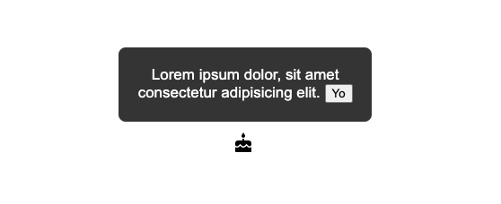

# EZ Popover

Is a very simple to use popover element. We leverage the power of CSS variables to allow for easy styling of the component. The popover element takes care of placement - no need to pass in a top, bottom, right, or left.

</img>

## Install

### CDN

```js
<script
  type="module"
  src="https://unpkg.com/ez-popover@1.0.32/index.js"
></script>
```

### NPM

npm install ez-popover

## Quickstart

```html
<head>
  <script
    type="module"
    src="https://unpkg.com/ez-popover@1.0.32/index.js"
  ></script>
</head>
<div id="p1">
  <!-- A wrapping element is NOT required but is recommended -->
  <ez-popover id="ez-popover1">
    <!-- every popover must have a unique id -->
    <button slot="popover__target">
      <!-- slot=popover__target triggers the popover -->
      Hover Me
    </button>
    <p slot="popover__body">
      <!-- slot=popover__body will be the popover content -->
      Lorem ipsum dolor, sit amet consectetur adipisicing elit.
    </p>
  </ez-popover>
</div>
```

## CSS Variables available

```css
--font__family: Arial;
--font__size: 17px;
--color__background: #333;
--color__text: white;
--popover__padding: 4px 16px;
--popover__border-radius: 8px;
--popover__textAlign: center;
--popover__maxWidth: 380px;
--popover__minWidth: 0px;
--popover__border_width: none;
--popover__border_color: none;
--popover__boxShadow: none;
--popover__zIndex: 100;
--arrow__indent: 12px;
```

## CSS Example

IMPORTANT - YOU MIGHT WANT TO CHANGE THE MIN OR MAX WIDTH OF THE POPOVER

```css
#p1 ez-popover {
  --font__size: 14px;
  --popover__minWidth: 200px;
}
```

## OPTIONS

  <ul>
    <li>keyframes - see <a href="https://developer.mozilla.org/en-US/docs/Web/API/Web_Animations_API/Keyframe_Formats">MDN link</a></li>
    <li>keyframeOptions - see <a href="https://developer.mozilla.org/en-US/docs/Web/API/Web_Animations_API/Keyframe_Formats">MDN link</a></li>
    <li>disableHover: string - "true" | "false" </li>  
    <li>showArrow: string - "true" | "false" </li>      
  </ul>

```html
<ez-popover disableHover="true" showArrow="true"></ez-popover>
```

## Programmatically Close Example

HTML SETUP

```html
<div id="p2">
  <ez-popover disableHover="true" id="ez-popover-control">
    <button id="slot1" slot="popover__target">
      I stay open
    </button>
    <p slot="popover__body" id="popover__body">
      Lorem ipsum dolor, sit amet consectetur adipisicing elit.
      <button data-popoverControl>Some Button Inside Popover</button>
    </p>
  </ez-popover>
</div>
<button data-popoverControl>
  Some button outside popover
</button>
```

JS SETUP

```js
// Select All Triggers
let allControlButtons = document.querySelectorAll(
  'button[data-popoverControl]'
);
// Select Trigger Element
let triggerElement = document.querySelector('#slot1');
function togglePopover() {
  triggerElement.click();
}

allControlButtons.forEach((btn) =>
  btn.addEventListener('click', togglePopover)
);
```
